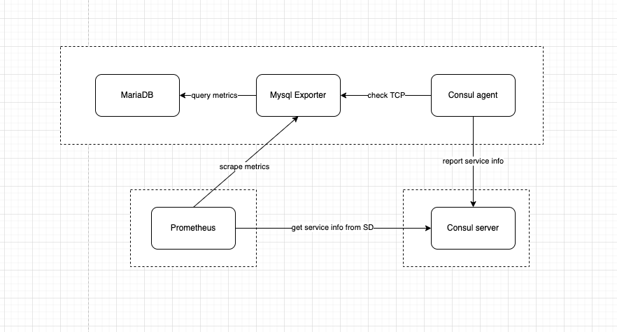
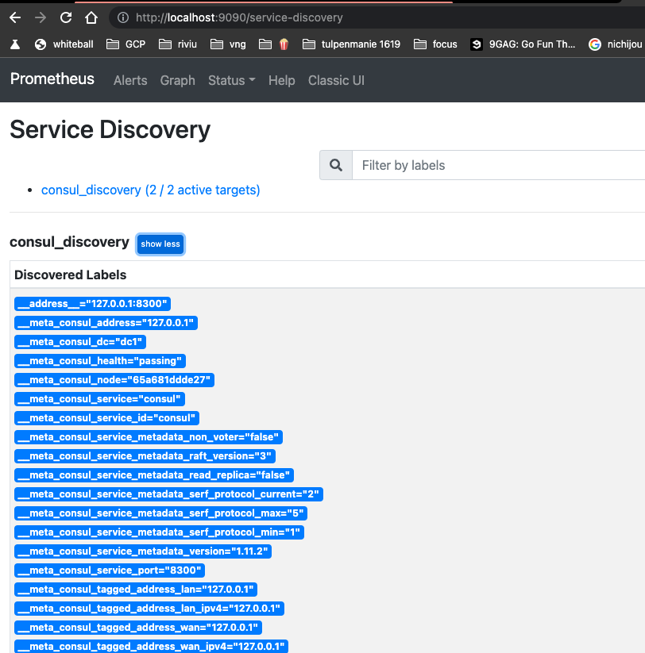

# consul_sd_configs
Using consul_sd_configs to discovery endpoint in prometheus

## Architecture


### Client(s) to be discovery
- `[program:mariadb]`: demo service to monitor in prometheus
- `[program:mysql_exporter]`: exporter mariadb metrics to prometheus format
- `[program:consul_agent]`: report service data to consul server (ip, port, status...)
### Server
- `[program:consul_server]`: consul server act as a database for prometheus query list service to scape metrics via GET /v1/catalog/services
- `[program:prometheus]`: real time metrics database

## Demo
```bash
# build and exec container
$ ./run

# start supervisor and it's subprocesses
$ ./daemon.sh
```
## Verify
- access http://localhost:9001/ for supervisor UI
- access http://localhost:9090/ for prometheus UI
- access http://localhost:8500/ for consul server UI
- wait 1-2mins and go to http://localhost:9090/service-discovery check if job `consul_discovery (2 / 2 active targets)` up and running

